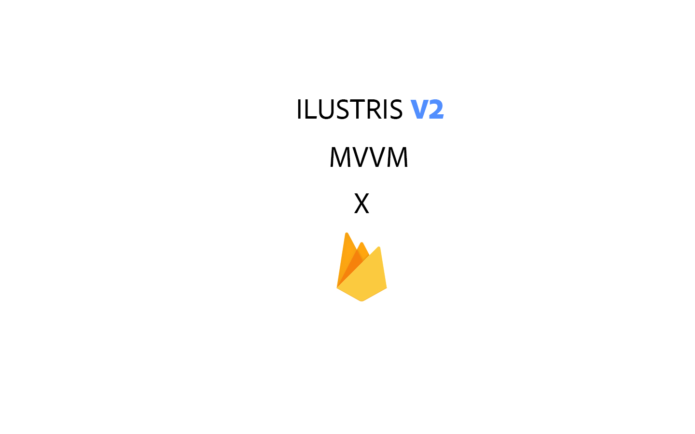

# Ilustris

This a base design and application system to use in further projects, this will be used as library to quickly help setup all needed to apps, like firebase treatment classes and callbacks.

Ilustris is based on mvm architecture,  it uses kotlin sealed and class + livedata

To use it you need to:
1. Have an firebase project created
2. Import the required firebase libraries that you need(highly recommend at least core, firestore and auth to get started)
***
_You can use the api implementation or the common implementation, it depends if you project its multi modular and requires access to classes from ilustris core_

### 3 . Firebase Libraries

* api platform('com.google.firebase:firebase-bom:+')
* api 'com.google.firebase:firebase-firestore-ktx'
* api 'com.google.firebase:firebase-core:+'`
* api 'com.firebaseui:firebase-ui-auth:+'`
* api 'com.google.firebase:firebase-auth:+'1.

### 4. Implement Ilustris core library
` api 'com.github.CaioProgramming:Ilustris:core:2.1.0' `

Now you're ready to go 😄 .

Check it out the [Wiki](https://github.com/CaioProgramming/Ilustris/wiki/Getting-started) to get started.
